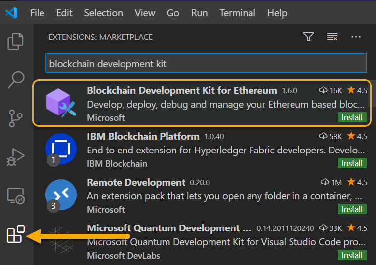
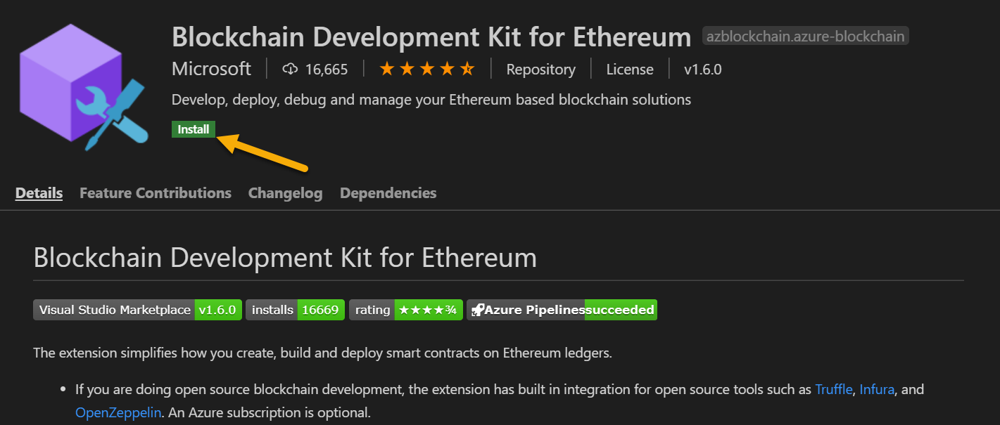
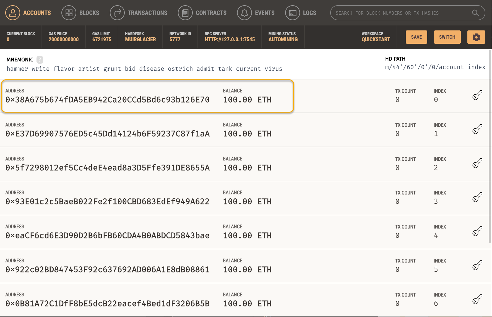
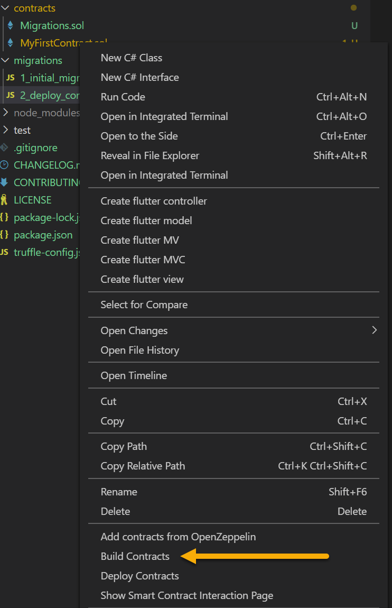
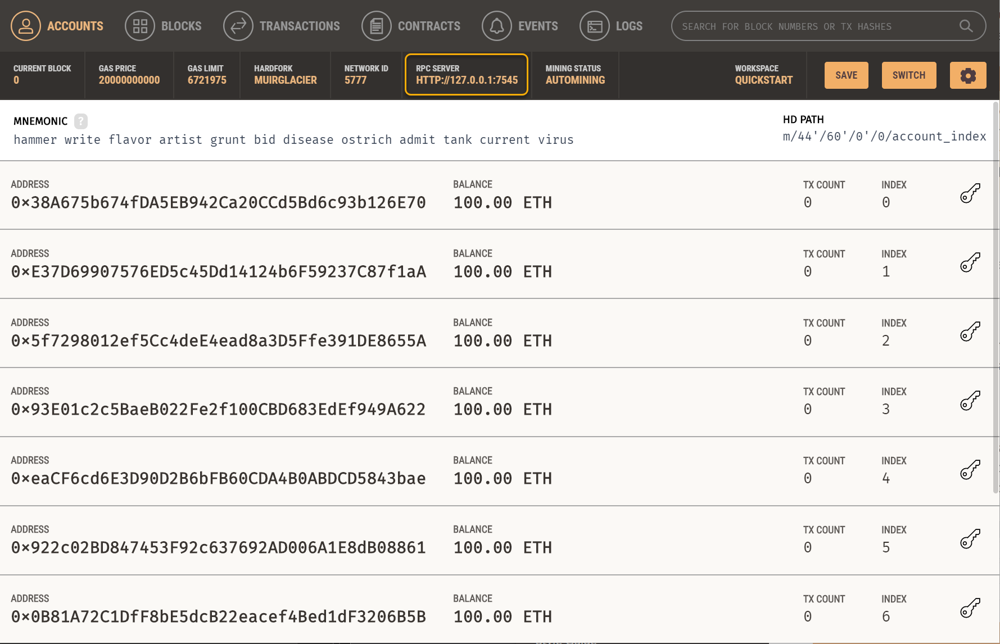
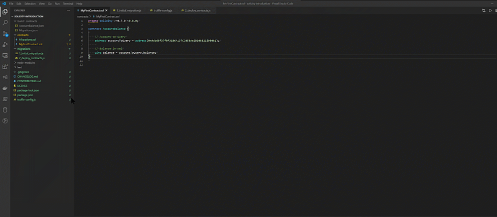
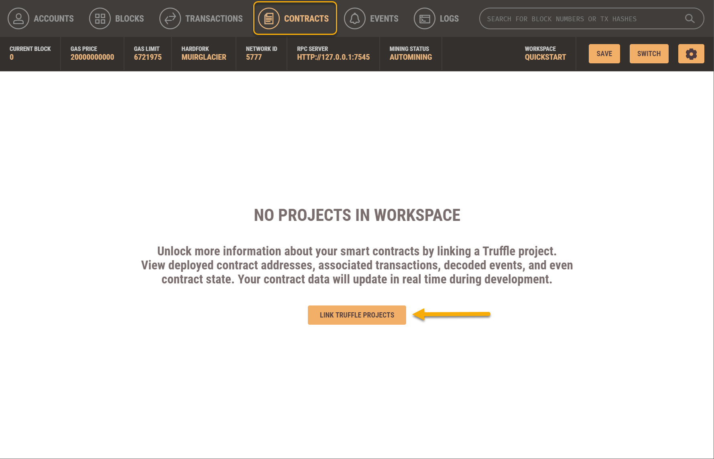
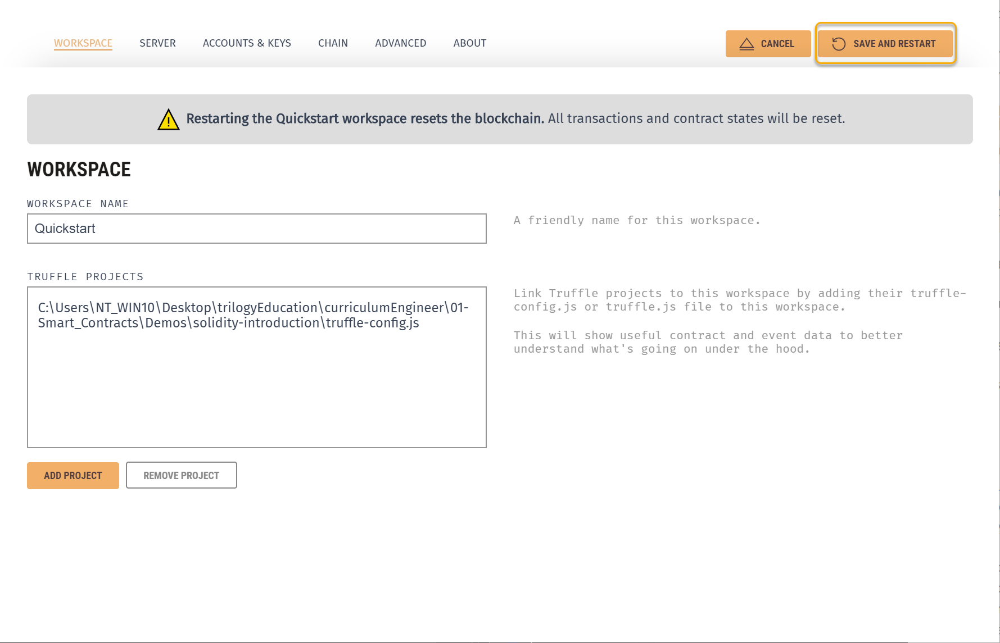
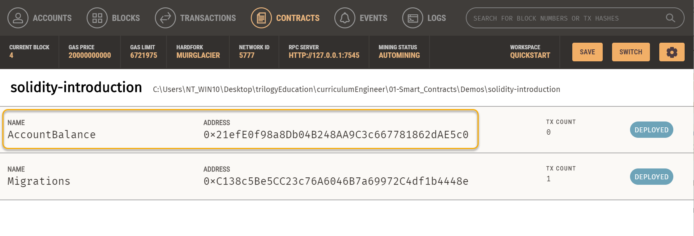
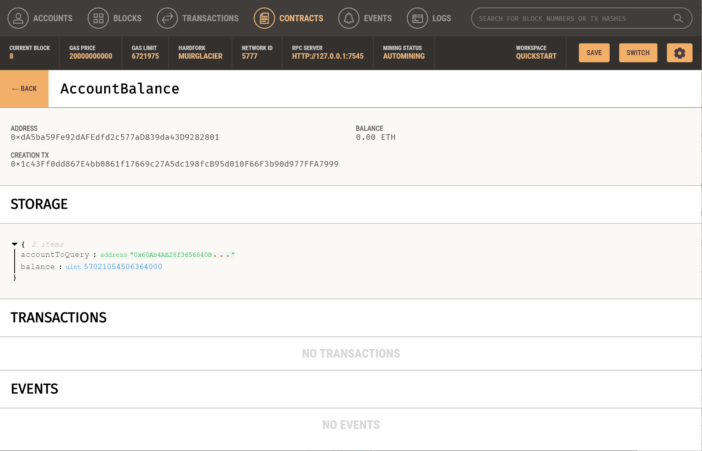

# Lesson 1: Smart Contracts

## Introduction to Smart Contracts

Ethereum was the first programmable blockchain quickly allowing it to become more than just a crypto currency. Entire applications are written and stored in Ethereum's blockchain coining a new type of application called decentralized applications. Decentralized applications have more than just financial applications though most use cases are financial in nature. JP Morgan was an early adopter of blockchain when they created [Quorum](https://www.goquorum.com/), an Ethereum-based blockchain, in order to leverage the security that blockchain provides for their own systems.

Solidity is the most widely used language for programming smart contracts. It is object oriented and statically typed, which means unlike python the variable types must be declared in the script. Once a smart contract is written in Solidity, it must be compiled and then uploaded into the blockchain where it will run within the context of the decentralized ledger. Special care must be taken to ensure the contract will fit within a block.

> **Challenge Connection** In this week’s Challenge, you’ll create a public smart contract in Solidity to process payments for personal loans using a multi-chain wallet on [coinbase](www.coinbase.com).

## Solidity Basics

### Environment Setup

To begin, install node.js if it is not already installed on your system. Go to the [download page](https://nodejs.org/en/download/) and download the 64bit version for your operating system. Once you have installed node.js, reboot and then open a command line interface. Type in `npm -v` to check that the node package manager is installed. The preceding command will return the version that is installed.

Now you will need to install one package from `npm`, truffle. Truffle is used for building and deploying the contracts.

To install Truffle, type:

`npm install -g truffle`

Then verify that truffle is installed by typing `truffle` in the command line.

Once truffle is installed, you will need Ganache a local Ethereum client that we will use for testing that is from truffle. It is available in both a graphical application and a command line utility. We will use the graphical application.

Install Ganache by visiting the Truffle website and installing the application:

https://www.trufflesuite.com/ganache

Next, install Microsoft's Blockchain Development Kit for Ethereum for vsCode. It will contain everything you need to get started in terms of compiling and uploading smart contracts. It will also allow us to debug smart contracts in vsCode.

Go to the extension installer located on the left side bar. Type in `Blockchain Development Kit for Ethereum` and click on the one that is published by Microsoft.



You will be directed to the extension's installation page where you will click the green install button.



That's it! You now have a development environment setup for writing and testing smart contracts in Solidity.

Let's get started by creating a new solidity project. Go to `View->Command Pallet` in the vsCode menu bar. Type in `Blockchain` and select `Blockchain: New Solidity Project`. Then `Create Basic Project` and you will be prompted to for where you want to create the project. Create a new directory called `solidity-introduction`.


Several files and directories will be created. The directories created are:

* **contracts** - This directory contains our smart contracts.
* **migrations** - This directory will keep track of the versions of our smart contracts.
* **test** - This directory will contain testing scripts for our smart contracts

It will also initialize the directory as a git repository and add a `.gitignore` that will ignore the compiled scripts if we choose to publish the repository.

Delete the `HelloBlockChain` scripts out of `contracts` and `test`. The projects are created with an example smart contract and we will not need it for this lesson however it is a good idea to scan over the script before and after as it will make more sense once you have a grasp on Solidity.

### Solidity Language Introduction

Solidity is statically typed, meaning you will need to declare variable types and that is a big difference from python where type declaration is optional. Solidity is also case sensitive and statements will end with a semi-colon `;`. Comments use two slashes `//` and code blocks will be enclosed in curly brackets `{}`.

#### Pragma

Solidity contracts will always start with a [`pragma`](https://docs.soliditylang.org/en/v0.7.5/layout-of-source-files.html). The `pragma` tells Soldity what verision of compiler should be used when compiling the contract. It ensures that even if a newer compiler comes out, you will still be able to compile your smart contract in the event the language has changed slightly. This does happen fairly frequently as Solidity is under active development, so its important to be cognizant of what version you are using when writing the `pragma`.

Create a new script in the `contracts` directory and call it `MyFirstContract.sol`. Next add a `pragma` statement:

``` java
// pragma statement
pragma solidity >=0.7.0 <0.8.0;
```

The `>=0.7.0 <0.8.0` tells a Solidity compiler that we expect to use any version greater than or equal to 0.7.0 and less than 0.8.0.

#### Contract

The [`contract`](https://docs.soliditylang.org/en/v0.7.5/contracts.html) keyword is necessary so that Solidity knows we are writing a contract. The name of the contract will follow the keyword and then all logic for the contract will be inside a set of curly brackets that follow the name.

``` java
// Create contract
contract AccountBalance {

}
```

Now we have an empty contract called `AccountBalance`. Lets create a contract to check the balance of an account before we try and transfers.

#### Variables

Since Solidity is statically typed, each variable's type must be declared at the time the variable is created.

Refer to the Solidity documentation page for a [complete list of variable types](https://docs.soliditylang.org/en/v0.7.5/types.html).

The [`address`](https://docs.soliditylang.org/en/v0.7.5/types.html#address) type will hold hashed addresses for an account. Lets create a variable called `accountToQuery` that will be of type `address`.

Now we need an account to query and this is where Ganache will come into play. Start Ganache and choose Quick Start for Ethereum.


You are now presented with list of test account addresses as well as a address and port that Ganache is listening on. Choose the first address and please note that every time you start Ganache these test addresses will change.



Now that you have an address, you can query the balance for that account.

>**Note**: The account balance [will be returned](https://docs.soliditylang.org/en/develop/units-and-global-variables.html?highlight=wei#members-of-address-types) in `wei`.

Add a variable called `accountToQuery` with the address you copied.

``` java
// Create contract
contract AccountBalance {

    // Account to Query
    address accountToQuery = address(0x9dbd8f37f0F31B6A137CC058Ae2B108821E98081);

}
```

To get the balance you will need to use the `balance` member of the `address` type, which will return the current account balance in wei. The `balance` will be a 256 bit unsigned integer so we will declare a variable to hold the balance named `balance` that will be of type [`uint`](https://docs.soliditylang.org/en/v0.7.5/types.html#integers).

``` java
// Create contract
contract AccountBalance {

    // Account to Query
    address accountToQuery = address(0x9dbd8f37f0F31B6A137CC058Ae2B108821E98081);
    
    // Balance in wei
    uint balance = accountToQuery.balance;
}
```

Now that you have a contract, you are ready to build and deploy it.

#### Build and Deploy

Before you can deploy you need to tell truffle what will be deployed and it will keep track of the migrations for you. Open the `migrations/2_deploy_contracts.js` script and replace it with the following:

``` javascript
var AccountBalance = artifacts.require("AccountBalance");

module.exports = deployer => {
    deployer.deploy(AccountBalance);
};
```

It will likely still have the name from `HelloBlockChain` in it. Simply put, you must replace `HelloBlockChain` with the name of your contract and in this case it is `AccountBalance`. `HelloBlockChain` also took one argument whereas `AccountBalance` does not.

Go back to the contracts folder and right click on `MyFirstContract.sol` then choose `Build Contract`.



Before you can deploy the contract you will need the address and port that Ganache is listening on. Find the RPC server cell on your Ganache instance and make note of the address and port.



Now you are ready to deploy your contract. Switch back to vsCode and right click on `MyFirstContract.sol` then choose `Deploy Contract`. You will need to create a deployment configuration the first time you deploy to the Ganache instance. Click `Create a new network` and fill in the address with what is on the RPC server.



Congratulations, You have just deployed your first smart contract! As you test blockchain networks you may end up having many networks that you connect to. VsCode's Blockchain Development Kit makes it easy to see your blockchain network configurations. At the bottom left, you may have noticed a new expandable window named `Blockchain Networks`. This window will provide an easy way to keep track of your network configurations.


Head over to Ganache and click on the `Contracts` tab. It will say that there are no projects available in the workspace. That's because when we started Ganache for that first address we didn't yet have a contract. Click on `Link Truffle Projects` and then `Add Project` navigating to the project directory then select the `truffle-config.js` file.



After that you will need to restart the workspace and this will cause all of the addresses to change. You will need to update the address in `accountToQuery` but you will see the contracts now.




Build and Deploy the contract again with the new account address in vsCode and check the `Contracts` tab in Ganache. It will update in real time with vsCode's deployment now.

>**Important**: You should always build the contract before deploying it. Were you to deploy without building it in this example you would deploy with the old address since that was what was used when it was complied previously.



Clicking on the contract will bring up it's state and we can see the current account balance in wei.



---

## Activity: Wei to Ether 

In this activity you will query an account balance and convert the balance to Ether. Wei are the smallest unit division of ether similar to a penny. How many Wei are in an Ether? 

$10^{18}$ - That's 1000000000000000000.

### Background 

Now that you know how to query an account's balance its your turn. You will create a new solidity project named `WeiToEther` and return an account's balance in ether.

### Files:
Download the following files to help you get started. 

[Instructions](/Activities/01-Wei_to_Ether/README.md)

[Starter Code](/Activities/01-Wei_to_Ether/Unsolved/wei_to_ether.sol)

[Deploy Contract Script](/Activities/01-Wei_to_Ether/Resources/2_deploy_contracts.js)

### Instructions

1. Create a new project called `WeiToEther`.
2. Create a new script in the `contracts` directory called `WeiToEther.sol`.
3. Create a new contract called `WeiToEther`.
4. Create a variable called `etherBalance` that will hold the converted balance.
5. Choose a test address from Ganache to be used in the contract.
6. Using the provided `2_deploy_contracts.js` to build the contract.
7. Deploy the contract to the local Ganache instance.
8. Check the contract's variable states in Ganache.

### Solution

How did you do? Check your solution with the following solution file:

[Solution](/Activities/01-Wei_to_Ether/Solved/wei_to_ether.sol)


### What’s Next? 

You now know how to set up a local block chain test instance and query accounts based on their address. You also learned that solidity is statically typed so the type of variable must be declared when the variable is created. In the next lesson you will learn how to use functions in Solidity to create more complex contracts. You will also learn about transactions and how to view the public ledger.

>**Challenge Connection**: Querying the account balance is the first step in processing transactions for a blockchain loan payment processor. You will need to be able to test your smart contracts before you deploy them on a public ledger.

---

© 2020 Trilogy Education Services, a 2U, Inc. brand. All Rights Reserved.